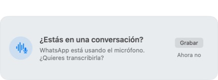
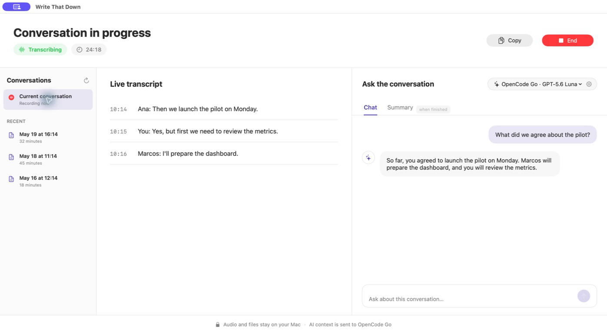
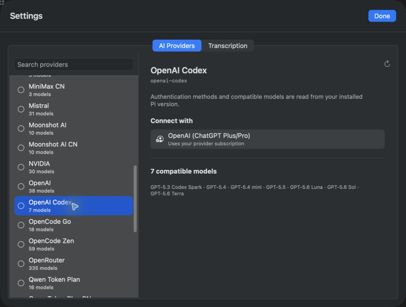
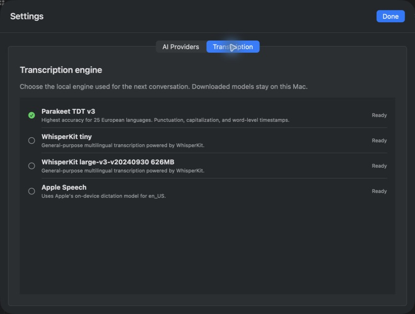
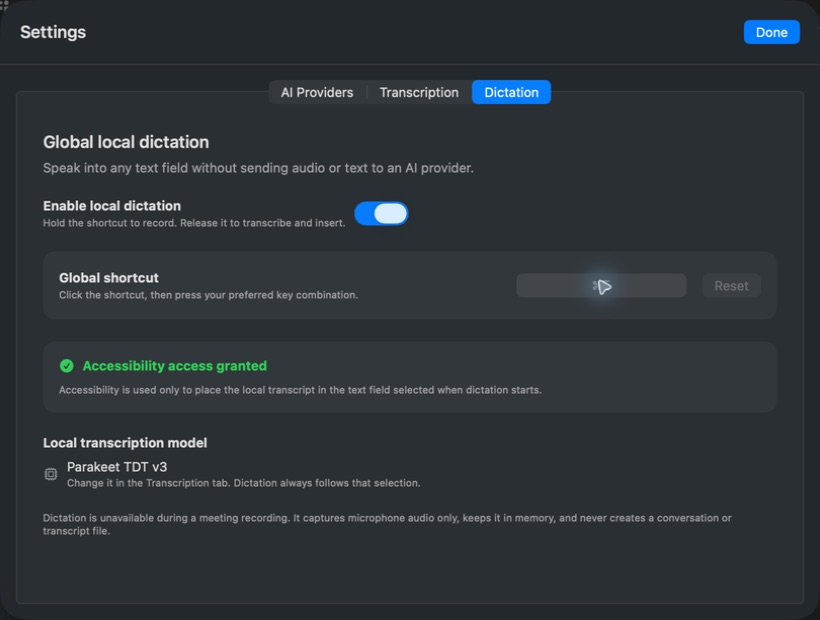
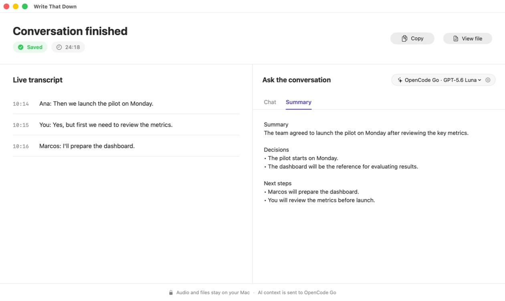

<p align="center">
  
</p>

<h1 align="center">Write That Down</h1>

<p align="center"><strong>Stop taking notes. Start being in the meeting.</strong></p>

<p align="center">
  A local-first macOS meeting copilot that transcribes on your Mac, answers
  questions while people are still talking through your chosen Pi provider, and
  turns the finished conversation into durable Markdown notes.
</p>

<p align="center">
  <a href="#install-from-source"><strong>Build &amp; install on your Mac →</strong></a>
  · <a href="#see-it-in-action">See it in action</a>
  · <a href="#privacy-without-hand-waving">Understand the privacy boundary</a>
</p>

<p align="center"><code>macOS 13+</code> · <code>Local transcription</code> · <code>Plain Markdown</code> · <code>Pi provider catalog</code></p>

## Stay in the conversation

Meetings move quickly. Taking notes pulls attention away at exactly the wrong
time, and copying transcript paths into another AI app breaks the flow again.
Write That Down keeps the live transcript and meeting chat together in one
window, then saves the durable result to files you control.

## See it in action

### 1. It knows when to auto-start—and when to ask

Zoom, Microsoft Teams, and a visible Google Meet window can start automatically
after sustained microphone activity. WhatsApp, unrelated browser use, and
unknown apps ask first. Decline once and Write That Down stays quiet until that
microphone episode ends.



### 2. Ask the conversation while it is happening

Connect OpenAI with ChatGPT, OpenCode Go with an API key, or any other provider
and sign-in method exposed by your installed Pi version. Then ask about decisions,
owners, dates, or unresolved questions. The assistant uses the transcript
available at that moment—there is no Codex task to open and no Markdown path to
copy.



### 3. Bring the providers and speech models you already use

The settings window reads Pi's installed provider catalog, including each
provider's models and supported connection methods. Sign in with a subscription,
paste an API key, or follow a device-code flow when Pi exposes it—without putting
credentials in a transcript or configuration file. The Transcription tab restores
the choice of local engine and downloaded model for the next conversation.

| AI providers from Pi | Local transcription engines |
| --- | --- |
|  |  |

### 4. Dictate into any app with the same local model

Enable **Local Dictation** in Settings, select a text field in any app, and hold
the global shortcut while you speak. Release it to transcribe and insert the
result at the cursor. The shortcut is configurable (and defaults to `⌘E`). It
follows the engine selected in the Transcription tab, captures microphone audio
immediately—even while a cold model is loading—keeps that audio in memory, and
never creates a meeting or contacts an AI provider.



### 5. Reopen any conversation and keep asking

Open the full app from the menu-bar widget at any time. The conversation
sidebar indexes your saved Markdown transcripts, so you can move between past
meetings, reread what happened, ask a new question, or generate a missing
summary without finding and copying a file path.

### 6. Finish with the important parts already organized

When recording ends, the transcript is finalized first. If an AI provider is
configured, Write That Down then generates a summary centered on supported
decisions, next steps, and open questions. An assistant failure never prevents
the underlying transcript from being saved.



## What you get

- **Local live transcription.** Microphone and system audio are mixed and
  transcribed on the Mac with a local speech engine.
- **Local dictation anywhere.** Hold a configurable global shortcut to record;
  release it to write speech into the selected text field with the same local
  transcription model.
- **A conversation-aware workspace.** Follow the transcript and ask grounded
  questions without switching apps, then revisit saved conversations from the
  built-in history.
- **An app you can reopen anytime.** Choose **Open Write That Down** in the
  menu-bar widget even when no meeting is being recorded.
- **A useful finish.** The completed transcript is saved first; an optional AI
  summary is generated afterward when the assistant is configured.
- **English or Spanish UI.** Write That Down follows the primary macOS language
  when it is English or Spanish and falls back to English for every other language.
- **Files that remain yours.** Final transcript segments are written
  incrementally to timestamped Markdown under `~/Transcripts` by default.
- **Captions built for reading.** Scroll back without being yanked to the bottom,
  jump back to live, resize the panel, change text size, or hide captions without
  stopping the recording.
- **One settings home.** Configure Pi providers and switch transcription engines
  from the gear button in the main window.
- **Speech-model choice.** Use WhisperKit, download the Parakeet TDT v3 ONNX
  model, or opt into Apple's on-device speech recognizer.

## Smart meeting detection

Write That Down starts with the operating system's microphone-in-use signal,
then applies a deliberately conservative source policy.

| Microphone source | Behavior |
| --- | --- |
| Zoom | Starts automatically after the confirmation window |
| Microsoft Teams | Starts automatically after the confirmation window |
| Browser/PWA with a visible Google Meet window | Starts automatically after the confirmation window |
| WhatsApp | Shows a record-or-ignore prompt |
| Other browser use or an unknown app | Shows a record-or-ignore prompt |
| Configured terminal, editor, OS helper, or Write That Down itself | Ignored |
| Unattributed microphone activity on macOS 13 | Shows a record-or-ignore prompt |

The default confirmation window is three seconds, which filters brief mic blips.
Rejecting an ambiguous source suppresses repeat prompts until the microphone is
released. On macOS 14+, CoreAudio process attribution makes the app-specific
policy possible; macOS 13 falls back to the safer ask-first behavior.

## Privacy without hand-waving

Write That Down is local-first, not “nothing ever touches a network.” The exact
boundary is:

| Data | What happens |
| --- | --- |
| Captured microphone and system audio | Stays on the Mac and is never sent to an AI provider |
| Speech recognition | Runs locally with the selected transcription engine |
| Global dictation | Captures microphone audio in memory, transcribes locally, and inserts only the resulting text into the selected field |
| Markdown transcript | Is stored locally in the configured output directory |
| A live assistant question | Sends the current final transcript text, the question, and bounded in-session chat context to the selected provider and model |
| End-of-meeting summary | Sends the completed final transcript text to the selected provider and model, then stores the returned summary locally |
| API keys and OAuth tokens | Stay in the macOS Keychain and are materialized only in a permission-restricted, short-lived Pi credential file |

Assistant traffic happens only after a provider has been connected. Processing
and retention depend on the selected provider and model's published
policy. Speech-model downloads also require network access when a model is not
already installed, but captured audio is never uploaded for transcription.

### Pi providers through a minimal boundary

The meeting assistant is intentionally not a general coding agent:

- Every model request pins the exact provider and model selected in the UI.
- Provider names, models, API-key forms, OAuth flows, and device-code steps come
  from the installed Pi runtime rather than a hardcoded app catalog.
- Pi runs once per request with no session, tools, extensions, skills, prompt
  templates, context files, or access to the user's normal Pi configuration.
- The transcript is sent over standard input; Pi is never asked to discover or
  read the Markdown file.
- The assistant never falls back to a different provider or account.
- Missing Pi or missing assistant credentials never disables recording, local
  transcription, captions, or transcript persistence.

## Install from source

### Requirements

- macOS 13 or newer
- Swift 6 / Xcode 16 or newer
- Swift Package Manager
- Pi Coding Agent only if you want chat and summaries
- Credentials for at least one Pi provider only if you want chat and summaries

### Build and install

Clone the repository and run the included installer. It builds a release app,
signs it with a local signing identity when one is available, and installs it in
`/Applications`:

```bash
git clone https://github.com/clioo/write-that-down-patrick.git
cd write-that-down-patrick
./install.sh
open /Applications/WriteThatDown.app
```

WhisperKit is the default transcription engine. Unless a local model folder is
configured, it downloads its speech model on first use and then runs inference
locally.

To install in your user Applications folder instead:

```bash
DEST="$HOME/Applications" ./install.sh
```

For development, run the deterministic test suite and launch without installing:

```bash
swift test
swift run WriteThatDown
```

### Enable chat and summaries

Install Pi Coding Agent so the `pi` executable is available:

```bash
npm install -g @earendil-works/pi-coding-agent
```

Write That Down looks for Pi in `~/.local/bin`, `/opt/homebrew/bin`, and
`/usr/local/bin`. For a command-line launch, an explicit path can be supplied:

```bash
WTD_PI_PATH=/absolute/path/to/pi swift run WriteThatDown
```

In the conversation window, click the gear, open **AI Providers**, and choose a
provider. The app shows exactly the connection methods Pi exposes. For example,
OpenAI Codex offers browser-based ChatGPT subscription sign-in, while OpenCode Go
offers an API-key form. OpenAI documents both ChatGPT and API-key authentication
for its local Codex clients in its [authentication guide](https://developers.openai.com/codex/auth).
Device codes are displayed as selectable text with a dedicated copy button, and
successful browser callbacks return to the connected state automatically.
Credentials are stored in the login Keychain rather than `config.json` or the
transcript directory.

Write That Down is an accessory app: it has no Dock icon and remains available
through its main window and menu-bar waveform.

## First-run setup

macOS may request:

- **Microphone** — required for the user's side of the conversation.
- **Screen Recording** — required by ScreenCaptureKit for system audio, even
  though Write That Down captures audio rather than screen video.
- **Notifications** — optional; used for recording and error alerts.
- **Speech Recognition** — requested only when Apple's native engine is selected.
- **Accessibility** — requested only when global dictation is enabled; it
  lets Write That Down insert the local transcript into the selected field.

If a required permission is missing, recording remains blocked and the app shows
a visible error. Grant access in **System Settings → Privacy & Security**, then
start a new microphone episode. For an automatic Zoom, Teams, or visible Meet
source, granting access while the mic remains active can start on the next poll.
After accepting an ambiguous-source prompt without permission, release the mic
and begin a new episode after granting access.

## Use it

1. Launch Write That Down and leave it running in the menu bar. Choose
   **Open Write That Down** there whenever you want the full conversation
   workspace.
2. Join Zoom, Teams, or a visible Google Meet. For WhatsApp or another ambiguous
   source, approve the compact prompt only when you want a transcript.
3. Follow the live transcript in the conversation window or floating caption
   panel.
4. If an AI provider is connected, ask questions in the Chat tab during the
   conversation.
5. Stop manually, or let microphone release / sustained inactivity finalize the
   session.
6. Select any saved conversation in the sidebar to reread it, ask follow-up
   questions, or generate its summary.

For local dictation outside meetings:

1. Open **Settings → Dictation**, choose a shortcut, and enable local dictation.
2. Grant Accessibility access when macOS asks.
3. Select a writable text field in any app and hold the shortcut while speaking.
4. Release the shortcut to transcribe and insert at the cursor.

Dictation is intentionally unavailable during an active meeting recording.

By default the files look like this:

```text
~/Transcripts/
└── 2026-08-20/
    ├── 14-25_34min.md
    └── 14-25_34min-summary.md
```

Final transcript lines include capture-relative timestamps:

```markdown
# Call 2026-08-20 14:25
**Date:** 2026-08-20 14:25
**Duration:** 34 min

## Transcript
[00:00:05] We should launch the pilot on Monday.
[00:00:09] I will prepare the dashboard.
```

## Local speech models

### WhisperKit (default)

The default engine is multilingual WhisperKit. Configure a pre-downloaded model
folder to prevent model downloads entirely:

```json
{
  "engine": "default",
  "language": "auto",
  "whisperModel": "openai_whisper-large-v3-v20240930_626MB",
  "whisperModelFolder": "/absolute/path/to/model-folder"
}
```

The folder must contain the compiled Core ML model assets and matching config.
The corresponding tokenizer must also be present in the local Hugging Face cache.

### Parakeet TDT v3

The downloadable catalog includes **Parakeet TDT v3 INT8**, an offline model of
about 670 MB covering 25 European languages with punctuation, capitalization,
and timestamps. Its ONNX artifacts come from a pinned Hugging Face revision and
must match their cataloged byte counts and SHA-256 digests before installation.

```json
{
  "engine": "sherpa",
  "speechModel": "parakeet-tdt-0.6b-v3-int8"
}
```

Model and runtime attribution is recorded in
[`THIRD_PARTY_NOTICES.md`](./THIRD_PARTY_NOTICES.md).

### Apple native speech

Set `engine` to `native` to use `SFSpeechRecognizer`. Write That Down requires
on-device recognition for the selected locale and refuses to silently fall back
to server-side recognition.

## Configuration

Configuration resolves as **defaults → config file → environment variables** and
is validated before operation starts.

Config file:

```text
~/Library/Application Support/WriteThatDown/config.json
```

| Setting | Environment variable | Default | Notes |
| --- | --- | --- | --- |
| `outputDir` | `WTD_OUTPUT_DIR` | `~/Transcripts` | Leading `~` is expanded |
| `language` | `WTD_LANGUAGE` | System primary language | `auto` is allowed |
| `engine` | `WTD_ENGINE` | `default` | `default`, `sherpa`, or `native` |
| `inactivityTimeoutMs` | `WTD_INACTIVITY_TIMEOUT_MS` | `900000` | 15 minutes |
| `pollIntervalMs` | `WTD_POLL_INTERVAL_MS` | `2000` | Detection cadence |
| `startConfirmMs` | `WTD_START_CONFIRM_MS` | `3000` | `0` starts on the first qualifying mic poll |
| `startRetryCooldownMs` | `WTD_START_RETRY_COOLDOWN_MS` | `60000` | Retry delay after startup failure |
| `excludedApps` | `WTD_EXCLUDED_APPS` | Terminals and development tools | Comma-separated bundle IDs; replaces defaults |
| `whisperModel` | `WTD_WHISPER_MODEL` | `base` | WhisperKit model name |
| `whisperModelFolder` | `WTD_WHISPER_MODEL_FOLDER` | None | Fully local WhisperKit folder |
| `speechModel` | `WTD_SPEECH_MODEL` | `parakeet-tdt-0.6b-v3-int8` | Catalog model for `sherpa` |

Useful checks:

```bash
# Show the fully resolved configuration.
swift run WriteThatDown --print-config

# Verify a local WhisperKit model loads and runs offline.
swift run WriteThatDown --check-model "/absolute/path/to/model-folder"

# Identify the bundle IDs of processes currently using microphone input.
swift run WriteThatDown --who-uses-mic
```

## Reliability by design

- `SessionOrchestrator` is a Swift actor and the single writer for recording
  state. Microphone samples, audio buffers, confirmation actions, manual stop,
  and shutdown all pass through one serial event stream.
- Final transcript segments are appended and synchronized incrementally, then
  the duration header and filename are finalized at the end.
- Assistant work starts outside the recording pipeline. Chat or summary errors
  cannot change a successfully saved recording into a failed session.
- Speech-model downloads are staged and verified before they can become the
  active installation.

The deterministic core suite runs without microphone hardware or network access:

```bash
swift test
```

## Diagnostics

Logs stay on the Mac under the `com.writethatdown.app` subsystem. The bundled
helper can inspect recent events and crash reports:

```bash
./logs.sh
./logs.sh errors 6h
./logs.sh detection 30m
./logs.sh stream
./logs.sh crash
```

## Current limitations

- Speaker diarization is not implemented; microphone and system audio are
  down-mixed into one transcription stream.
- Apple's native speech engine often commits final segments at the end of a
  session even though partial captions update live.
- Browser-hosted meetings auto-start only when a visible Google Meet window can
  be identified. Other browser microphone use asks first.
- Chat and summaries require Pi Coding Agent plus a connected provider account.

## Technical reference

The normative behavior and test matrix live in [`SPEC.md`](./SPEC.md). Third-party
model and runtime notices live in
[`THIRD_PARTY_NOTICES.md`](./THIRD_PARTY_NOTICES.md).

<sub>The SpongeBob and Patrick hero is unofficial fan artwork inspired by the
“Write that down!” moment in “The Camping Episode.” This project is not
affiliated with or endorsed by Nickelodeon or the characters' rights holders.</sub>
